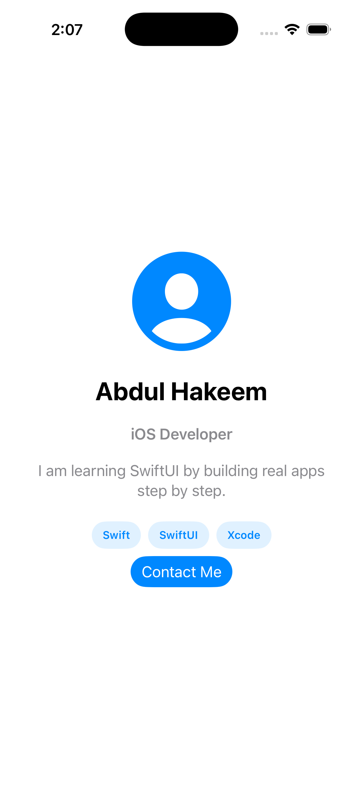

# Profile Card App

Profile Card App is a beginner SwiftUI project built in Module 01 of the iOS App Development with Swift & SwiftUI course.

## What It Shows

- Profile avatar
- Name
- Role
- Short bio
- Three skill tags
- Contact button

## Built With

- Swift
- SwiftUI
- Xcode

## How To Run

1. Open `ProfileCard.xcodeproj` in Xcode.
2. Select an iPhone Simulator.
3. Click Run.

## Screenshot

## Course Submission Checklist

- [ ] App runs in Simulator
- [ ] Profile screen is visible
- [ ] Screenshot added
- [ ] README completed
- [ ] Project pushed to GitHub
